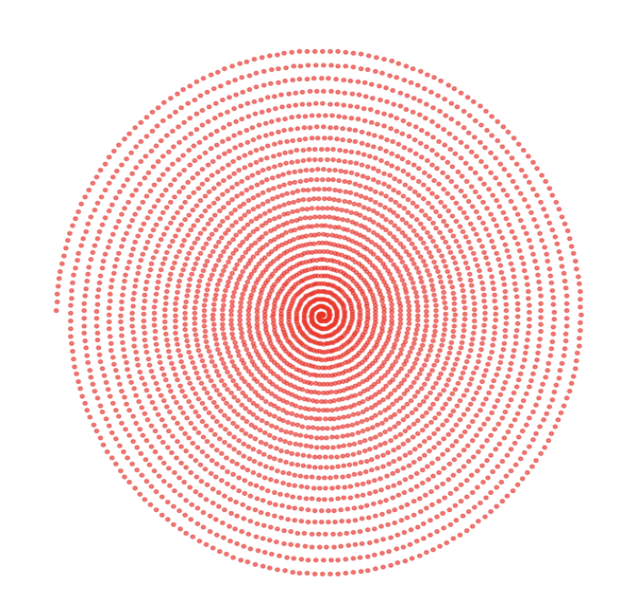
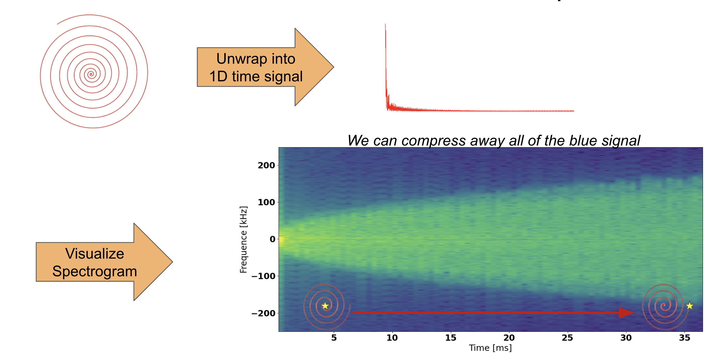

# Final Report
## Introduction
There is a lot of Magnetic Resonance Imaging (MR) specific lingo and knowledge that is partially covered in these [slides](https://docs.google.com/presentation/d/1Yr8Crx2qpC4Yb7XK0pZmD8wiBaTLO-82u-vvuH3MRRc/edit?usp=sharing). It is highly recommended to have these as a reference when reading this report.
 
MRI is an imaging modality that offers superior soft tissue contrast in comparison to other medical imaging modalities. However, it is not used nearly as much as it should be. Most radiologists must settle for lesser quality images due to the cost and time requirements of forming an MR image.
 
There are many reasons why MR images are so cost and time intensive, but the one we will focus on today is data storage and reconstruction times. The idea is that if we can compress our MR data files, we can improve reconstruction time or save space on costly hospital servers.
 
The solution provided in this project will address both costly reconstruction times as well data size mitigation. Specifically, we will be focusing on compressing spiral data:
 

A single spiral (shown in red) contains time-series data (starting from the center out) points of the spatial frequency (2D fourier transform) domain of our image of interest. In addition to the value of the spatial frequency domain, there is also the coordinates. These are two aspects to the data that come with each acquisition. Here is what that looks like:

 
This collected data is then run through a reconstruction algorithm which will yield our desired image. MR data is typically stored as a collection of 1 or many of these spirals, and that is what we want to compress. In reality, we will have more than a single spiral. That is MR systems have multiple coils, and each of them will 'see' a different image which is weighted differently based on the coil's proximity. Here is an example:

 
So, suppose we have $C$ coils, and each coil acquires a spiral in frequency domain that collects a total of $N$ points. The total data storage requirement scales with $NC$. Compressing the complex valued frequency domain measurements will have much more compression savings than the frequency domain coordinates, since there is only one set of coordinates but $C$ sets of complex valued data.
 
## Literature/Code Review
Spiral acquisitions [1] have been very popular in the literature, but are only recently being used in the clinic. Most improvements to MRI reconstructions using spiral, or any other acquisition, focus on the optimization problem's conditioning [2]. The method we propose is to use interpolation to compress the overall spiral number of data points. LFZip [3] takes predicted data from any predictor (such as interpolation) and subtracts it from the data we want to compress, and focuses on compressing the residuals. The idea is that the residuals are much easier to quantize, and have a lower entropy overall. We plan to combine the method in [3] to data acquired using spiral acquisitions [1], and use some clever signal processing that leverages MRI physics.
 
1. Glover GH. Spiral imaging in fMRI. Neuroimage. 2012 Aug 15;62(2):706-12. doi: 10.1016/j.neuroimage.2011.10.039. Epub 2011 Oct 20. PMID: 22036995; PMCID: PMC3279621.
 
2. Ong F, Uecker M, Lustig M. Accelerating Non-Cartesian MRI Reconstruction Convergence Using k-Space Preconditioning. IEEE Trans Med Imaging. 2020 May;39(5):1646-1654. doi: 10.1109/TMI.2019.2954121. Epub 2019 Nov 19. PMID: 31751232; PMCID: PMC7285911.
 
## Methods
 
We will break our compression plan into 4 main parts: *Spectrogram Compression*, *Residual Quantization*, *Trajectory Compression*, and the final *Lossless Compression*
 
### Spectrogram Compression
We start our compression procedure with a very simple observation: Spiral data is non-uniformly sampled in frequency domain:

The points are closer together in the center than they are at the edges. This is not by mistake, it is due to the fact that the MRI hardware has a 'warm up time'. It traverses the frequency domain very slowly in the center, and then faster at the edges. We can exploit this since nyquist tells us the actual spatial sampling requirement is more than satisfied in the center.
 
To visualize this, let us suppose that one were to take an acquired spiral trajectory and unwind it into a 1D time signal. We can plot the spectrogram of this signal to get a feel for it's temporal behavior:

We notice a really distinct cutoff in frequency that changes with time. At a given slice in time, the more 'blue' area there is, the more we can compress! The method of compression is to use a low-pass filter, followed by decimation. The only catch is that the filter bandwidth and amount of decimation changes with time. So, we use a *Time Variant Low Pass Filter* (TVLPF)
 
After resampling, our data will be uniformly spaced along the spiral:

Which should buy us roughly 2X compression.
 
 
### Residual Quantization
#### Residual Part
Once the spiral is resampled, we will yet again treat it as a time signal and decimate by a factor of $M$. That is, we only keep every $M^{th}$ sample. Then, we attempt to reconstruct the data points in between using a polynomial interpolation, and compress the residual of this interpolation.
 
To formalize this:

#### Quantization Part
Quantization of the residual signal $r[n]$ is done using a K-means scalar quantization. We have a parameter `bits_resid` which determines how many bits we are giving to the quantization of this residual term. We found decent performance with about 4 bits. The residual terms are very much focused around 0 and have a normal-like distribution.
 
### Trajectory Compression
We want to compress the trajectory data, which is the parametric equations describing the coordinates of the time series spiral. In its raw form, this is what the trajectory looks like:

To simplify things, let us convert this to magnitude ($R$) phase ($\phi$) data:

We compress this magnitude phase data interpolation. We keep the first ~100 points, since that part changes more than the rest of the signal. Then, we skip every 100 points, and interpolate the missing values with a cubic interpolation. This works really well since the signal is so predictable.
 
### Lossless Cherry on Top
The final step in our method is to add lossless compression to the resulting bitstream. We chose to use gzip to add an additional compression at the end of all the lossy compressors. Here is a block diagram of how this all works:

 
## Results and Experiments
In order to see the benefits of our approach, the Time Variant Low Pass Filter (TVLPF), we will compare it against a Zero Order Hold, which basically does no averaging whatsoever. This will help us appreciate the noise robustness of the low-pass approach. 
 
We will show results in a way that characterizes how much boost we get from each block in the diagram above. This will be done using rate distortion plots.
 
After we characterize the compression boost from each block, we will use a safe set of parameters from the rate distortion plots and view the final image.
 
### Block Characterization
To characterize each block in the diagram, let us first explain all of the parameters per block, as well as the values we will test them for:
 
*TVLPF Block*
- dkmax - parameter between [1, 2] that controls the new spiral spacing. Increase ---> more compression
 
*Residual Quantization Block*
- ksp_skip - parameter between [1, 50]. Same as $M$ in the latex explanation. Increase ---> more compression
- bits_resid - parameter between [1, 6]. amount of bits for the k-means scalar quantizer. Decrease ---> more compression
 
*Trajectory Compressor Block*
- trj_start - parameter between [0, 300]. The compression will only start after trj_start points into the trajectory. Decrease ---> more compression
- trj_skip - parameter between [1, 50]. Decimation factor. Increase ---> more compression
 
Now we will show all of the rate distortion plots for each of the parameters individually. Note that the distortion is MSE in the image domain:  
#### TVLPF Block Rate Distortion
 
 
#### Residual Quantization Block Rate Distortion 
  
 
 
#### Trajectory Compressor Block Rate Distortion
 
 
 
#### Rate Distortion take aways
There are two things to consider when analyzing the plots above. First, the overall filesize. Some compressors don't change the file size all that much. Second is how horizontal the plots are. This is desirable since it gives minimal distortion for a decreased rate. Taking these into consideration, we can see that `ksp_skip` and `bits_resid` are doing most of the heavy lifting, as expected. These are the main parameters of the residual quantization block. Next is the decimation block, which gives us a decent boost in compression. And finally, the trajectory compression block does not make a huge difference, but is certainly still nice to have.
 
### Final Image Comparison
From the plots, we can determine a safe set of parameters to use for compression:
- dkmax - 1.5
- ksp_skip - 20
- bits_resid - 5
- trj_start - 300
- trj_skip - 20
Which will yield the final set of images:
 
The images TVLPF and Zero Order are compressed by 16X!
 
## Conclusion
In this work, we built a customized MRI compression scheme. The first part, (TVLPF Decimator) leverages MRI hardware limitations to achieve an approximate 2X compression in a noise robust way. The time variant filtering will reduce the noise penalty of decimation. Then, we used a predictive coding approach where we used cubic interpolation to predict some values in our time signals, and then we heavily compressed the residual terms. This is where most of our compression comes from. Finally, we also compress the set of coordinates by viewing them in magnitude/phase coordinates.
 
The biggest issue is that there are many parameters to choose. We attempted to characterize the effect of each parameter, but this can still be problematic. Some future work may be to validate the choice of compression parameters with multiple datasets.
 
That being said, this compressor was able to achieve 15-20X compression factors (depending on how much distortion is allowable), which is much more than standard image-domain compression techniques. And, it does it in a way that induces minimal noise penalties. This is a really big problem with MRI data. We almost always have low SNR images, and it is important to deal with the noise appropriately.
