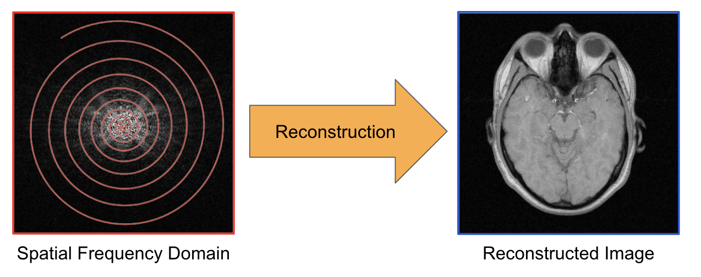
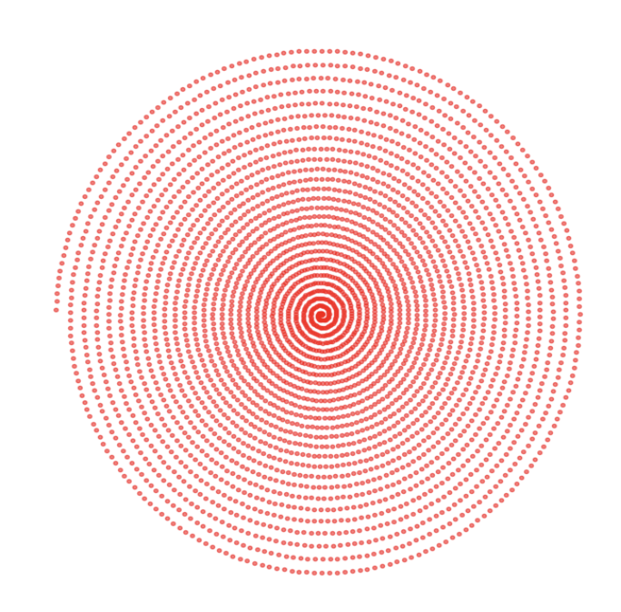
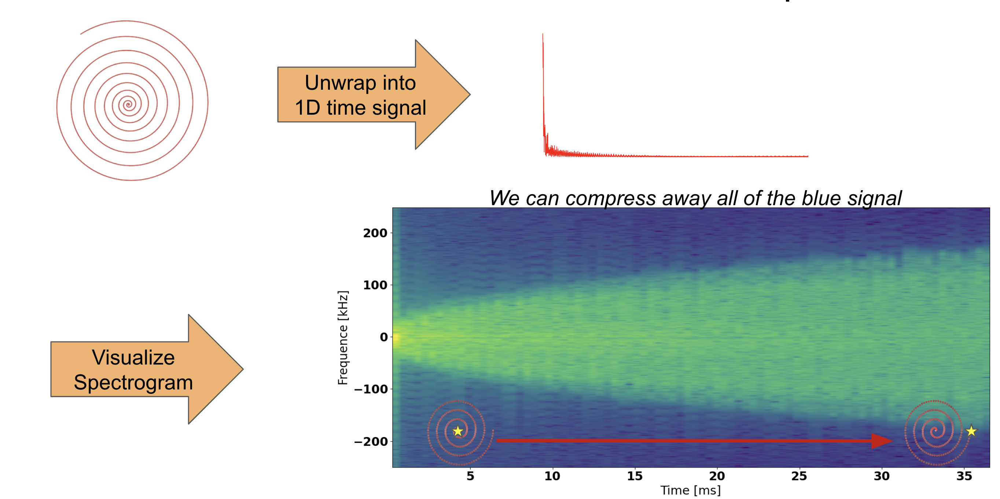
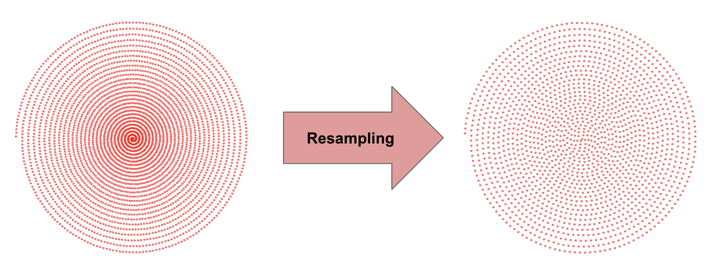
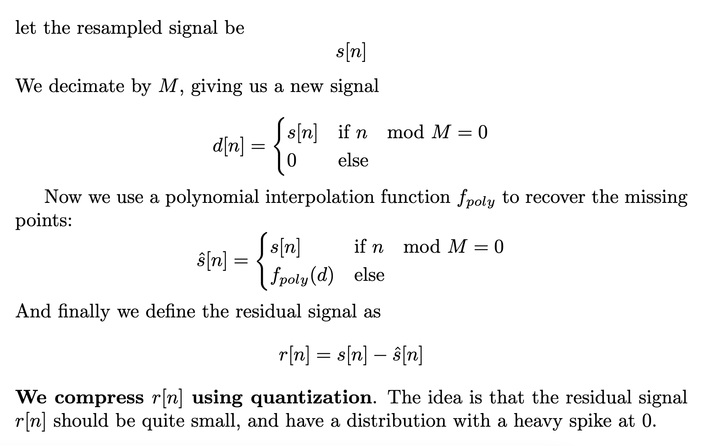
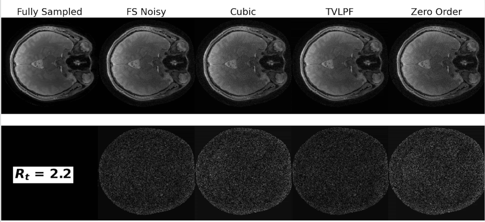
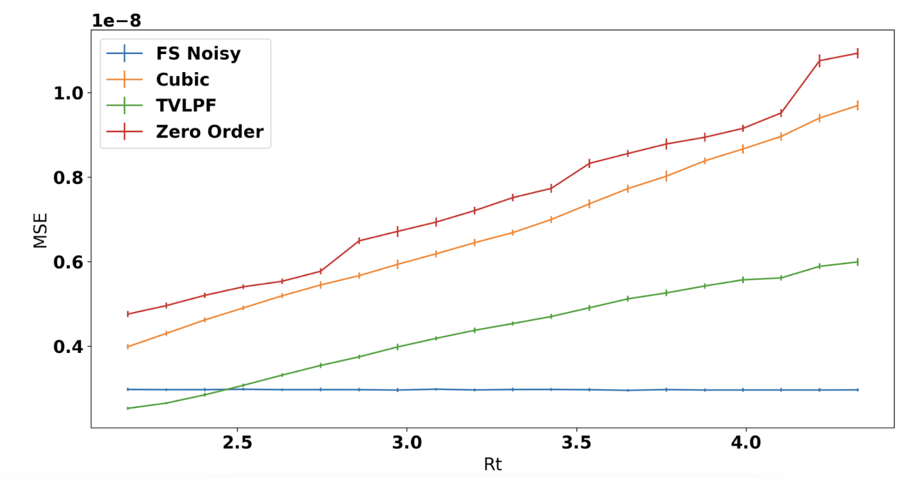
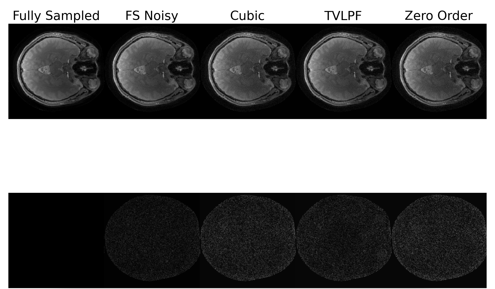

# Milestone Report
## Introduction
There is a lot of Magnetic Resonance Imaging (MR) specific lingo and knowledge that is partially covered in these [slides](https://docs.google.com/presentation/d/1Yr8Crx2qpC4Yb7XK0pZmD8wiBaTLO-82u-vvuH3MRRc/edit?usp=sharing). It is highly reccomended to have these as a reference when reading this report.

MRI is an imaging modality that offers superior soft tissue contrast in comparison to other medical imaging modalities. However, it is not used nearly as much as it should be. Most radiologists must settle for lesser quality images due to the cost and time requirements of forming an MR image. 

There are many reasons why MR images are so cost and time intensive, but the one we will focus on today is data storage and reconstruction times. The idea is that if we can compress our MR data files, we can improve reconstruction time or save space on costly hospital servers. 

The solution provided in this project will adress both costly reconstruction times as well data size midigation. Specifically, we will be focusing on compressing spiral data:


A single spiral (shown in red) contains time-series data (starting from the center out) points of the spatial frequency (2D fourier transform) domian of our image of interest. This collected data is then run through a reconstruction algorithm which will yield our desired image. MR data is typically stores as a collection of 1 or many of these spirals, and that is what we want to compress.

## Literature/Code Review
Spiral acuqisitions [1] have been very popular in the literature, but are only recently being used in the clinic. Most improvements to MRI reconstructions using spiral, or any other acqusition, focus on the optimization problem's conditioning [2]. The method we propose is to use interpolation to compress the overal spiral number of data points. LFZip [3] takes predicted data from any predictor (such as interpolation) and subtracts it from the data we want to compress, and focuses on compressing the residuals. The idea is that the residuals are much easier to quantize, and have a lower entropy overall. We plan to combine the method in [3] to data acquired using spiral acquisitions [1], and use some clever signal processing that leverages MRI physics.

1. Glover GH. Spiral imaging in fMRI. Neuroimage. 2012 Aug 15;62(2):706-12. doi: 10.1016/j.neuroimage.2011.10.039. Epub 2011 Oct 20. PMID: 22036995; PMCID: PMC3279621.

2. Ong F, Uecker M, Lustig M. Accelerating Non-Cartesian MRI Reconstruction Convergence Using k-Space Preconditioning. IEEE Trans Med Imaging. 2020 May;39(5):1646-1654. doi: 10.1109/TMI.2019.2954121. Epub 2019 Nov 19. PMID: 31751232; PMCID: PMC7285911.

## Methods

We will break our compression plan into 2 main parts: *Resampling* and *Residual Quantization*

### Resampling
We start our compression procedure with a very simple observation: Spiral data is non-uniformly sampled in frequeny domain:

The points are closer together in the center than they are at the edges. This is not by mistake, it is due to the fact that the MRI hardware has a 'warm up time'. It traverses frequency domain very slowly in the center, and then faster at the edges. We can exploit this since nyuist tells us the actual spatial sampling requirement more than satisfied in the center.

To visualize this, let us suppose that one were to take an acquired spiral trajectory and unwind it into a 1D time signal. We can plot the spectrogram of this signal to get a feel for it's temporal behavior:

We notice a really distinct cutoff in frequency that changes with time. At a given slice in time, the more 'blue' area there is, the more we can compress! The method of compression is to use a low-pass filter, followed by decimation. The only catch is that the filter bandwidth and amount of decimation changes with time. So, we use a *Time Variant Low Pass Filter* (TVLPF) 

After resampling, our data will be uniformly spaced along the spiral:

Which should buy us roughly 2X compression.


### Residual Quanitzation
Once the spiral is resampled, we will yet again treat it as a time signal and decimate by a factor of $M$. That is, we only keep every $M^{th}$ sample. Then, we attempt to reconstruct the datapoints in between using a polynomial interpolation, and compress the residual of this interpolation. 

To formalize this:



### Lossless Cherry on Top
The final step in our method is to add lossless compression to the resulting bitstream.

## Progress Report
So far, the *Resampling* portion is complete, and can be found in the `compress_specgram` function in  
```
mri/recon_compress.py
```
This has already been benchmarked  against a few other resampling approaches (polynomial, nearest neighbor) with good results:


The bottom row is the error in the reconstructed image relative to the true noise-free image. FS Noisy is short for Fully Sampled with Noise.

One thing to note is that in accelerated MRI, we almost always have noise. So, we benchmarked against varying simulated noise levels. The method we propose (TVLPF) performs much better than polynomial interpolation approaches. We use $R_t$ to denote the compression factor. 

Here is a plot showing the MSE between the clean and noisy images for different compression factors:

Notice that the TVLPF method performs better than the non-compressed (FS Noisy) version, in the presence of noise. This is true because the we are averaging away the blue area in the spectogram (previous section) which acts as a denoiser.


The *Redisual Quanitzation* method has also been implimented, but is still being tested. The implimetation details can be found in `encode_file` and `decode_file` in 
```
mri/recon_compress.py
```

There are some preliminary results of data axccelerated by 6X shown here:


It is worth noting that we have not yet implimented any lossy compression, or any clever quanitzation methods. It is a simply scalar quantization (not even histogram based) and we are already acheiving 6X acceleration! This leads to what is left to do:

## Remaining Parts
1. Impliment a more inteligent quanitzation algorithm. We are currently just doing a simple scalar quantization on the residuals
2. Impliment lossy compressor on binary files. Or current compression scheme does not include any lossy compressors.
3. Generate more tests on the entire pipeline. We currently have tested the *Resampling* part quite well, but need to more comprehensively test the whole pipeline.
4. Benchmark on more data. We are limited to a pretty small dataset. We would like to try timing the reconstruction time on a 3D dataset to see if we get a siginificant boost in reconstruction time. This is 'icing on the cake', and will only be done if time permits.  